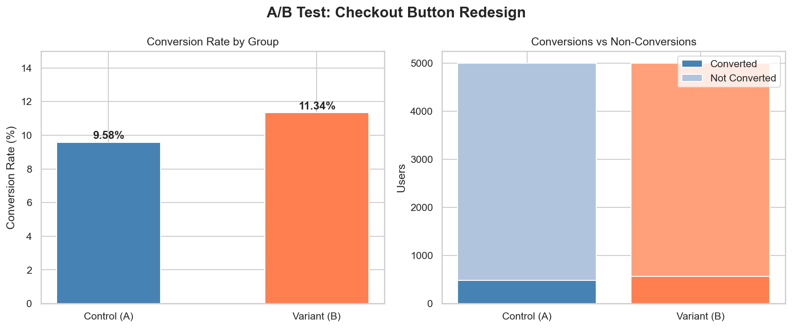

# A/B Test Analysis: Checkout Button Redesign

## Overview

Simulated and analyzed an A/B test for an e-commerce checkout button redesign using Python. Applied statistical hypothesis testing to determine whether the observed difference in conversion rates was statistically significant or due to random chance.

## Tools Used
Python (pandas, numpy, scipy, matplotlib, seaborn), Jupyter Notebook

## The Experiment
| | Control (A) | Variant (B) |
|---|---|---|
| Users | 5,000 | 5,000 |
| Conversions | 479 | 567 |
| Conversion Rate | 9.58% | 11.34% |

## Key Findings
- **Variant B outperformed Control A by 1.76 percentage points**
- **Relative lift of 18.4%** — a meaningful improvement for any e-commerce business
- **P-value of 0.0045** — well below the 0.05 significance threshold
- **Result is statistically significant**, meaning the difference is not due to random chance

## Recommendation
Roll out Variant B to all users. With a p-value of 0.0045 and an 18.4% lift in conversions, the data strongly supports adopting the new checkout button design.

## Concepts Demonstrated
- A/B test design (control vs variant, sample size)
- Conversion rate analysis
- Chi-square hypothesis testing
- Statistical significance and p-value interpretation
- Business recommendation from statistical output
